# examen

## 0. Configuracion de ip

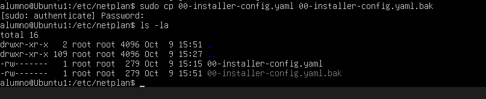
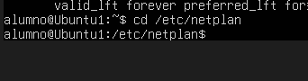
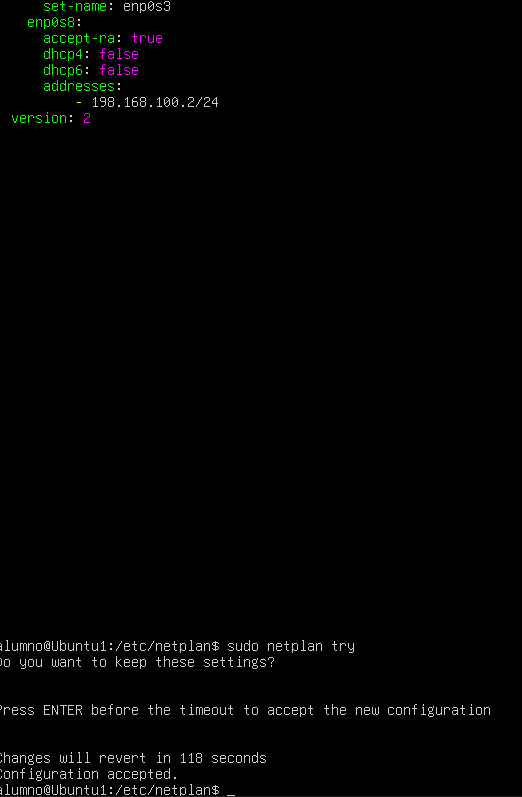
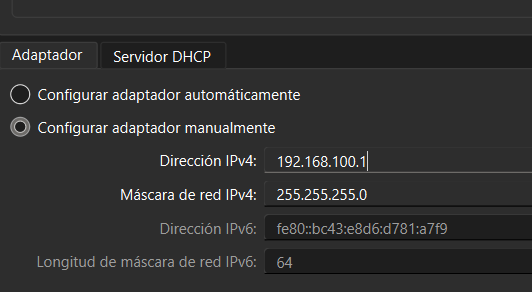
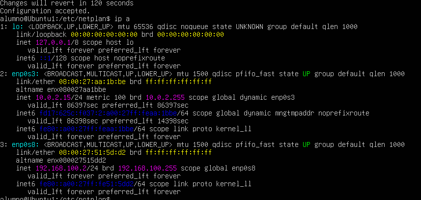

## 1. Actualizar los repositorios

Primero actualizamos la información de los repositorios de Ubuntu:

```bash
sudo apt update
```
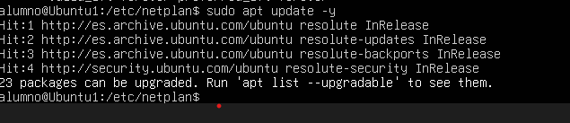

## 2. Instalar el cockpit

`
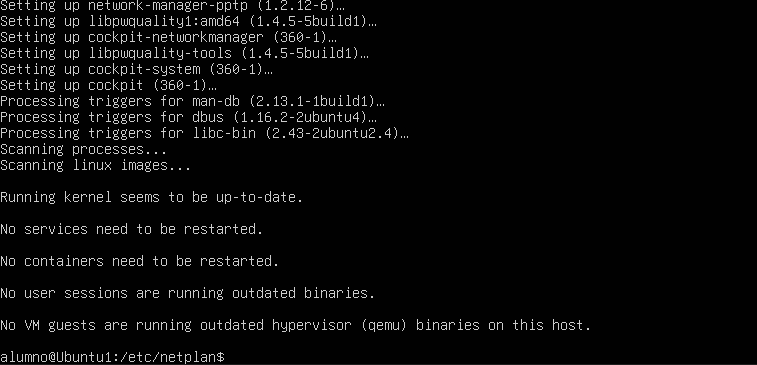

## 3. Empezar el cockpit


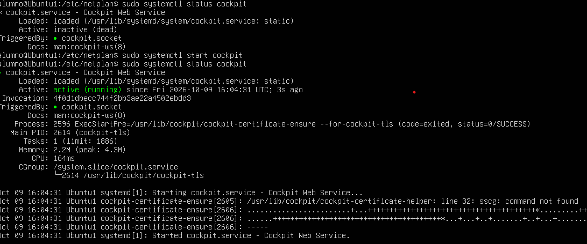

## 4. Permitir ssh y ufw

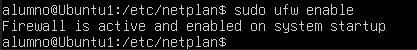
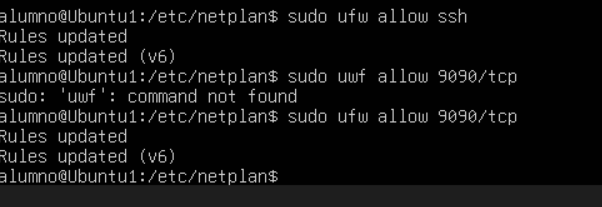


## 6. Abrirlo desde navegador

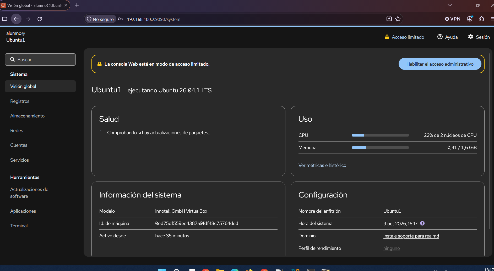


